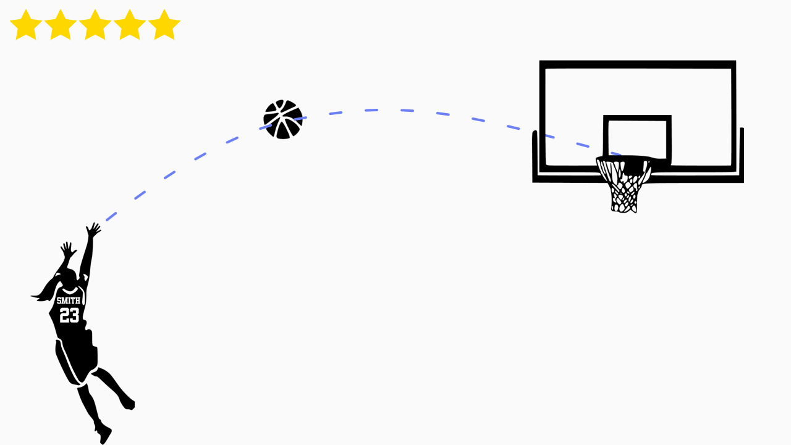

# Домашнее задание "Баскетбол"

Это домашнее задание №5 в рамках курса Android разработки в Технополисе 2019.
Ваша задача - написать мини игру "Баскетбол":

В игре есть баскетболист, задача которого забивать мяч в кольцо. Бросок происходит путем проведения пальцем по экрану в сторону кольца. Скорость и направление движения пальца задают траекторию перемещения мяча. После того как палец был поднят, мяч должен начать двигаться.
Для большей наглядности, можно строить примерную траекторию мяча. 

Необходимо фиксировать насколько "удачный" был бросок: можно записывать количество попаданий / точность, или придумать какие-то свои критерии.

На экране должны быть нарисованы:
- баскетболист;
- баскетбольный мяч;
- баскетбольное кольцо;
- счет.

Требования к реализации:
- в приложении должно быть хоть одно Custom View (например, можно сделать отображение счета в виде звездочек);
- движение мяча должно быть анимировано;
- качество броска должно фиксироваться и записываться в счет(это может быть: попадание в кольцо, точность броска и т.п.).

Приведеные выше требования являются минимальными, все что вы придумаете дополнительно будет оценено положительно. 
Можно ввести какие-то правила, выбор мяча, ограничение по времени на игру, лидер-борды и т.п.

Не нужно тратить много времени на "физику" полета мяча и того как он будет двигаться после пересечения с кольцом.

В проекте есть изображения баскетболиста, мяча и кольца. Можно использовать эти изображения или взять любые свои. 
Для выполнении задания рекомендуется ознакомиться с [материалом курса](https://polis-mail-ru.github.io/2019-android/05_custom_view_animations_touches/).

Решение сдавать в виде пул-реквеста, в пул-реквесте должны быть только изменения, относящиеся к решению.

